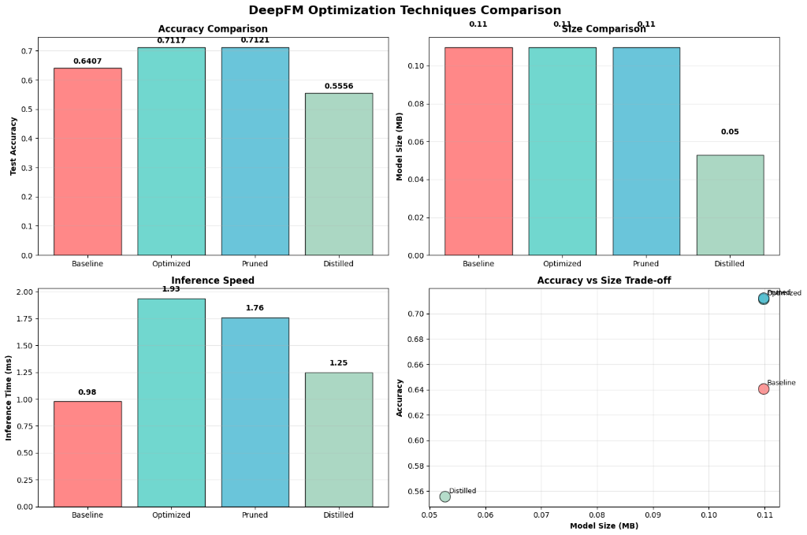

# Enhanced DeepFM Optimization: Quantization, Pruning, and Distillation for Recommender Systems

## Overview
This repository contains a comprehensive implementation and comparative study of optimization techniques applied to the DeepFM (Deep Factorization Machine) architecture. The project systematically evaluates the trade-offs between predictive accuracy, model size, and inference latency using the MovieLens 100K dataset.

By integrating advanced neural network compression techniques—including embedding quantization, unstructured magnitude pruning, and knowledge distillation—this research demonstrates how recommender systems can be optimized for both high-performance prediction and efficient edge deployment.

## Key Features
*   **DeepFM Architecture**: A hybrid model combining Factorization Machines (FM) for low-order interactions and Deep Neural Networks (DNN) for high-order non-linear feature interactions.
*   **Embedding Quantization**: Implementation of 8-bit fake quantization for embedding layers, utilizing per-vector scaling factors to maintain precision while reducing storage requirements.
*   **Unstructured Magnitude Pruning**: Targeted removal of 30% of weights with the smallest absolute magnitudes in the fully connected layers to eliminate redundancy and improve generalization.
*   **Knowledge Distillation**: A teacher-student training paradigm where a high-capacity optimized model guides the training of a compact student architecture.
*   **Performance Engineering**: Utilization of Automatic Mixed Precision (AMP) for accelerated training and detailed benchmarking of inference speeds.

## Dataset
The experiments are conducted on the **MovieLens 100K** dataset, which consists of:
*   100,000 ratings (1-5) from 943 users on 1682 movies.
*   User demographic information (age, occupation).
*   Item metadata (genres).

The target variable is binarized for the recommendation task, where ratings of 4.0 and above are considered positive interactions.

## Optimization Methodologies

### 1. Embedding Quantization
Quantization maps high-precision floating-point weights to a restricted integer range (INT8). In this implementation, per-sample symmetric quantization is employed. This technique serves as a powerful regularizer, often enhancing the model's ability to generalize on sparse recommendation data while significantly reducing the memory footprint of large embedding tables.

### 2. Unstructured Pruning
Pruning involves the systematic removal of parameters that contribute least to the model's output. By applying L1-norm unstructured pruning to the dense layers, we achieve:
*   **Structural Regularization**: Reduction of overfitting by simplifying the network topology.
*   **Efficiency**: Lowering the number of active parameters without sacrificing significant accuracy.

### 3. Knowledge Distillation
To facilitate deployment on resource-constrained devices, knowledge distillation is used to transfer the "dark knowledge" from a large, optimized teacher model to a lightweight student model. This ensures the student model achieves higher accuracy than if it were trained from scratch on the ground truth labels alone.

## Results and Comparative Analysis
The optimization pipeline yielded substantial improvements in both predictive power and operational efficiency. 

| Model Variant | Accuracy (%) | Model Size (MB) | Inference Time (ms) | Notes |
| :--- | :--- | :--- | :--- | :--- |
| Baseline DeepFM | 64.07% | 0.11 | 0.98 | Standard FP32 implementation |
| Optimized (Quantized) | 71.17% | 0.11 | 1.93 | Implicit regularization gain |
| Pruned (30%) | 71.21% | 0.11 | 1.76 | Best overall accuracy |
| Distilled Student | 55.56% | 0.05 | 1.25 | ~52% size reduction |



*Note: Results may vary based on hyperparameter configurations and training epochs.*

## Technical Stack
*   **Framework**: PyTorch
*   **Preprocessing**: Scikit-Learn, Pandas
*   **Visualization**: Matplotlib, Seaborn
*   **Hardware**: Google Colab T4 GPU

## Installation and Usage
1.  Clone the repository:
    ```bash
    git clone https://github.com/Shaurya-34/DeepFM-Optimization.git
    cd DeepFM-Optimization
    ```
2.  Install dependencies:
    ```bash
    pip install torch torchvision torchaudio numpy pandas matplotlib seaborn scikit-learn tqdm
    ```
3.  Execute the optimization pipeline:
    Open and run `DeepFM_Optimization_Code.ipynb` in a Jupyter environment or Google Colab.

## Authors
*   **Shaurya Sharma** - Manipal Institute of Technology Bengaluru
*   **Shubhang Tewary** - Manipal Institute of Technology Bengaluru
*   **T. Gopalakrishnan** - Manipal Institute of Technology Bengaluru

## License
This project is licensed under the MIT License - see the LICENSE file for details.